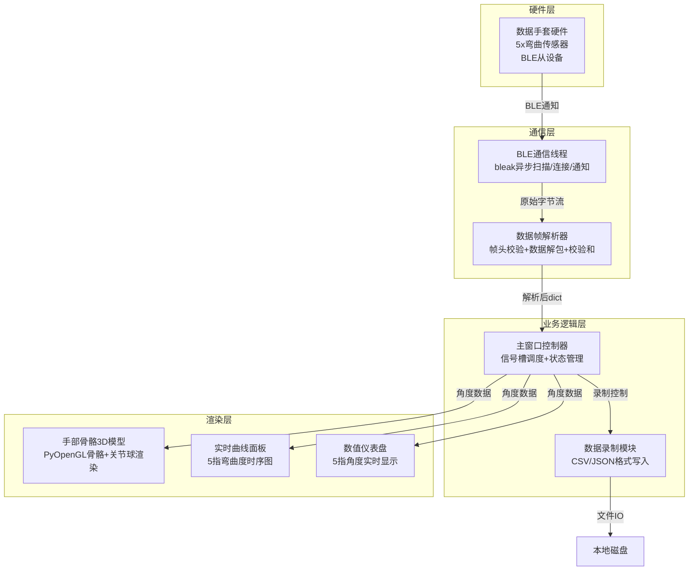
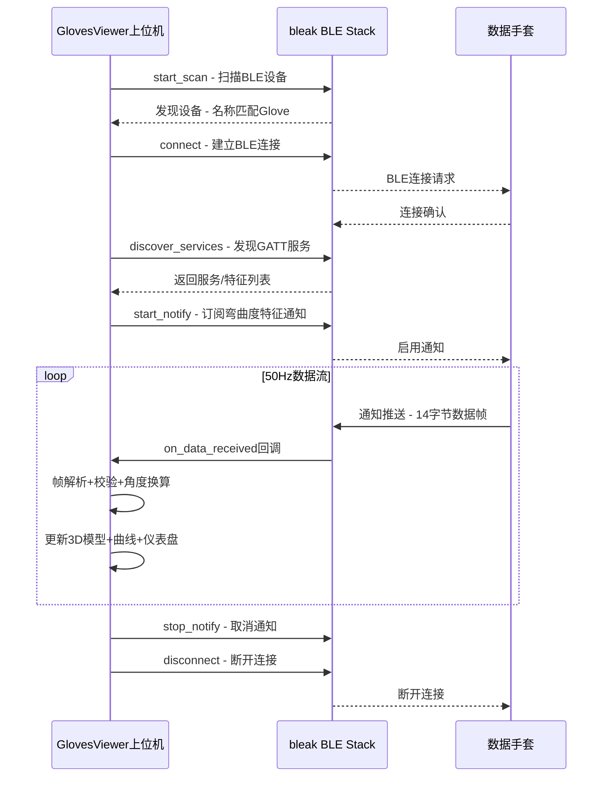
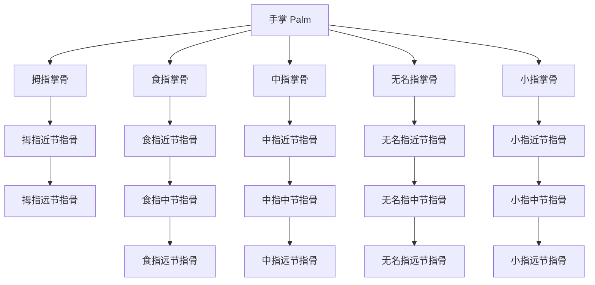
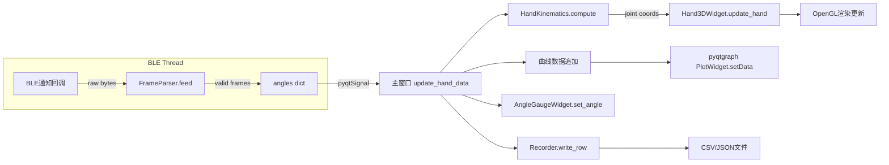

# GlovesViewer 数据手套上位机 — 架构设计文档

## 1. 项目概述

GlovesViewer 是一款单手数据手套上位机软件，通过 BLE 低功耗蓝牙与数据手套硬件通信，实时接收5个手指的弯曲度数据（0°~180°），并在三维场景中渲染手部骨骼模型，直观反映真实手部动作。

---

## 2. 技术栈

| 类别 | 选型 | 说明 |
|------|------|------|
| 语言 | Python 3.13 | 与现有项目保持一致 |
| GUI框架 | PyQt5 | 与现有项目保持一致 |
| 3D渲染 | PyOpenGL + pyqtgraph.opengl | 手部骨骼模型渲染 |
| 蓝牙通信 | bleak | 跨平台BLE库，支持Windows/Linux/macOS |
| 数据可视化 | pyqtgraph | 实时曲线绘制 |
| 数据存储 | csv / json | 录制数据本地保存 |

---

## 3. 系统架构



---

## 4. BLE通信协议设计

### 4.1 GATT服务定义

| 项目 | UUID | 说明 |
|------|------|------|
| Service | `0x4E4A` | 数据手套自定义服务 |
| Characteristic | `0x4E4A-0001` | 手指弯曲度数据通知，Notify属性 |
| Characteristic | `0x4E4A-0002` | 命令下发写入，Write属性 |

### 4.2 数据帧格式

每帧 **14字节**，50Hz发送频率：

```
+--------+--------+--------+--------+--------+--------+--------+--------+--------+--------+--------+--------+--------+--------+
| Byte0  | Byte1  | Byte2  | Byte3  | Byte4  | Byte5  | Byte6  | Byte7  | Byte8  | Byte9  | Byte10 | Byte11 | Byte12 | Byte13 |
+--------+--------+--------+--------+--------+--------+--------+--------+--------+--------+--------+--------+--------+--------+
| 0x4E   | 0x4A   | Thumb  | Thumb  | Index  | Index  | Middle | Middle | Ring   | Ring   | Pinky  | Pinky  | CRC16  | CRC16  |
| HEADER | HEADER | L      | H      | L      | H      | L      | H      | L      | H      | L      | H      | Low    | High   |
+--------+--------+--------+--------+--------+--------+--------+--------+--------+--------+--------+--------+--------+--------+
```

| 字段 | 偏移 | 长度 | 说明 |
|------|------|------|------|
| 帧头 | 0-1 | 2B | 固定 `0x4E 0x4A`，与IMUViewer风格一致 |
| 拇指 Thumb | 2-3 | 2B | uint16 LE，单位0.1°，范围0~1800对应0°~180° |
| 食指 Index | 4-5 | 2B | uint16 LE，同上 |
| 中指 Middle | 6-7 | 2B | uint16 LE，同上 |
| 无名指 Ring | 8-9 | 2B | uint16 LE，同上 |
| 小指 Pinky | 10-11 | 2B | uint16 LE，同上 |
| CRC16 | 12-13 | 2B | CRC16-CCITT校验，覆盖Byte0~Byte11 |

**角度换算公式**：`angle_deg = raw_uint16 / 10.0`

### 4.3 数据流时序



---

## 5. 手部骨骼3D模型设计

### 5.1 骨骼层级结构



### 5.2 骨骼尺寸参数（单位：相对长度）

| 手指 | 掌骨 | 近节 | 中节 | 远节 |
|------|------|------|------|------|
| 拇指 | 1.0 | 1.2 | 1.0 | — |
| 食指 | 1.6 | 1.6 | 1.2 | 0.9 |
| 中指 | 1.6 | 1.8 | 1.4 | 1.0 |
| 无名指 | 1.6 | 1.7 | 1.3 | 0.9 |
| 小指 | 1.4 | 1.3 | 1.0 | 0.8 |

### 5.3 弯曲度映射策略

每根手指只有1个弯曲度自由度（0°~180°），需要合理分配到各关节：

- **拇指**（2个关节）：弯曲度按 50%:50% 分配给掌指关节和指间关节
- **其余四指**（3个关节）：弯曲度按 40%:35%:25% 分配给掌指关节、近指间关节、远指间关节
- **最大弯曲限制**：掌指关节最大90°，指间关节最大100°
- **手掌展开**：所有角度为0°时，手指完全伸直

### 5.4 渲染方案

使用 `pyqtgraph.opengl` 的 `GLLinePlotItem` 绘制骨骼线段，`GLMeshItem`（球体）绘制关节球：

```
骨骼线段 ─── 白色/浅灰色圆柱形线段，宽度3px
关节球   ─── 橙色半透明球体，半径0.15
指尖球   ─── 红色半透明球体，半径0.12
手掌面   ─── 灰色半透明平面网格
```

**更新机制**：每次收到新数据帧时，根据5个手指角度重新计算所有关节点的3D坐标，通过 `setData` 更新线段位置，通过 `resetTransform` + `translate` 更新关节球位置。

---

## 6. 软件模块设计

### 6.1 目录结构

```
libs/GlovesViewer/
├── main.py                    # 程序入口，GlovesViewer主窗口类
├── requirements.txt           # 依赖清单
├── README.md                  # 项目说明
├── .github/
│   └── workflows/
│       └── build.yml          # CI/CD打包配置
├── core/
│   ├── ble_thread.py          # BLE通信线程（扫描/连接/通知/断开）
│   ├── frame_parser.py        # 数据帧解析器（帧头检测+CRC校验+解包）
│   └── hand_kinematics.py     # 手部运动学模型（正运动学计算+关节坐标）
└── ui/
    ├── main_window.py         # UI静态布局类
    ├── hand_3d_widget.py       # 手部3D骨骼渲染组件
    └── widgets.py             # 自定义小组件（角度仪表盘等）
```

### 6.2 模块职责

#### `core/ble_thread.py` — BLE通信线程

```python
class BLEThread(QtCore.QObject):
    """基于bleak的BLE通信管理器，运行在QThread中"""
    # 信号
    device_found = pyqtSignal(str, str)     # name, address
    data_received = pyqtSignal(dict)        # {thumb, index, middle, ring, pinky}
    log_received = pyqtSignal(str)          # 日志消息
    connection_changed = pyqtSignal(bool)   # 连接状态变化

    # 核心方法
    async scan_devices()           # 扫描BLE设备
    async connect(address)         # 连接指定设备
    async start_notify()           # 订阅特征通知
    async disconnect()             # 断开连接
    _on_notification(handle, data) # 通知回调
```

#### `core/frame_parser.py` — 数据帧解析器

```python
class FrameParser:
    """BLE数据帧解析器，处理粘包/半包"""
    def __init__(self):
        self.buffer = bytearray()

    def feed(self, raw_bytes: bytearray) -> list[dict]:
        """输入原始字节，输出解析后的数据包列表"""
        # 1. 追加到缓冲区
        # 2. 搜索帧头 0x4E 0x4A
        # 3. 提取14字节完整帧
        # 4. CRC16校验
        # 5. 解包5个uint16角度值
        # 6. 返回 [{thumb: 45.0, index: 30.0, ...}]
```

#### `core/hand_kinematics.py` — 手部运动学模型

```python
class HandKinematics:
    """手部正运动学计算，根据5指弯曲度计算所有关节3D坐标"""
    FINGER_NAMES = ['thumb', 'index', 'middle', 'ring', 'pinky']

    def __init__(self):
        # 骨骼长度参数
        # 关节弯曲比例参数
        # 手掌基础坐标

    def compute(self, angles: dict) -> dict:
        """
        输入: {thumb: 45.0, index: 30.0, middle: 60.0, ring: 20.0, pinky: 10.0}
        输出: {
            joints: {thumb: [p0, p1, p2, p3], index: [...], ...},  # 关节坐标
            bones:  {thumb: [(p0,p1),(p1,p2),(p2,p3)], ...}        # 骨骼线段端点
        }
        """
```

#### `ui/hand_3d_widget.py` — 手部3D渲染组件

```python
class Hand3DWidget(gl.GLViewWidget):
    """继承GLViewWidget，封装手部骨骼3D渲染逻辑"""
    def __init__(self):
        # 创建手掌网格
        # 创建5组骨骼线段 GLLinePlotItem
        # 创建关节球 GLMeshItem（球体）
        # 创建坐标轴指示

    def update_hand(self, joint_data: dict):
        """根据运动学计算结果更新3D模型"""
        # 更新骨骼线段位置
        # 更新关节球位置
```

#### `ui/widgets.py` — 自定义组件

```python
class AngleGaugeWidget(QtWidgets.QWidget):
    """单个手指角度仪表盘，显示手指名称+角度值+弧形进度条"""
    def __init__(self, finger_name: str, color: str):
        # 手指名称标签
        # 角度数值标签
        # 弧形进度条（0°~180°）

    def set_angle(self, angle: float):
        """更新角度显示"""
```

---

## 7. UI界面布局

```
+========================================================================================+
|  GlovesViewer v1.0                                                        状态栏        |
+==================+===================================+================================+
|                  |                                   |                                |
|  [BLE设备连接]    |                                   |   [实时曲线面板]                |
|  设备列表 ▼      |                                   |   ┌──────────────────────┐     |
|  [扫描] [连接]    |                                   |   │  拇指 ────────────   │     |
|                  |      [3D手部骨骼模型]               |   │  食指 ────────────   │     |
|  [数据录制]      |                                   |   │  中指 ────────────   │     |
|  格式: CSV ▼    |         🖐️ 实时手部动作             |   │  无名指 ──────────   │     |
|  [开始录制]      |                                   |   │  小指 ────────────   │     |
|  [停止录制]      |                                   |   └──────────────────────┘     |
|                  |                                   |                                |
|  [角度仪表盘]    |                                   |                                |
|  拇指: 45.0°    |                                   |                                |
|  食指: 30.0°    |                                   |                                |
|  中指: 60.0°    |                                   |                                |
|  无名指: 20.0°  |                                   |                                |
|  小指: 10.0°    |                                   |                                |
|                  |                                   |                                |
|  [原始数据流]    |                                   |                                |
|  0x4E4A...      |                                   |                                |
|                  |                                   |                                |
+==================+===================================+================================+
|  数据率: 50Hz  |  丢包率: 0.0%  |  连接状态: Active                                    |
+========================================================================================+
```

**三栏布局**（与IMUViewer风格一致）：
- **左栏**（270px）：BLE连接控制、录制控制、5指角度仪表盘、原始数据流
- **中栏**（弹性）：3D手部骨骼模型渲染区
- **右栏**（弹性）：5指弯曲度实时时序曲线

---

## 8. 数据流架构



---

## 9. 关键技术要点

### 9.1 bleak异步集成PyQt5

bleak 是基于 asyncio 的库，而 PyQt5 使用事件循环。解决方案：

- 使用 `QThread` + `asyncio.new_event_loop()` 在独立线程中运行 bleak 事件循环
- 通过 `pyqtSignal` 将数据从BLE线程安全传递到主线程
- 扫描、连接、断开等操作通过 `QMetaObject.invokeMethod` 跨线程调用

### 9.2 3D手部模型性能优化

- 50Hz更新频率下，避免每帧创建/销毁OpenGL对象
- 预创建所有 `GLLinePlotItem` 和 `GLMeshItem`，仅更新坐标数据
- 关节球使用 `GLMeshItem` 的 `resetTransform` + `translate` 实现位置更新
- 骨骼线段使用 `setData` 更新端点坐标

### 9.3 CRC16-CCITT校验

```python
def crc16_ccitt(data: bytes, init=0xFFFF) -> int:
    crc = init
    for byte in data:
        crc ^= byte << 8
        for _ in range(8):
            if crc & 0x8000:
                crc = (crc << 1) ^ 0x1021
            else:
                crc <<= 1
            crc &= 0xFFFF
    return crc
```

---

## 10. 依赖清单

```
# requirements.txt
numpy
PyQt5
pyqtgraph
PyOpenGL
bleak
```

---

## 11. 开发任务分解

1. 搭建项目骨架（目录结构 + requirements.txt + README.md）
2. 实现 `core/frame_parser.py` — 数据帧解析器
3. 实现 `core/hand_kinematics.py` — 手部运动学模型
4. 实现 `core/ble_thread.py` — BLE通信线程
5. 实现 `ui/widgets.py` — 角度仪表盘组件
6. 实现 `ui/hand_3d_widget.py` — 手部3D骨骼渲染组件
7. 实现 `ui/main_window.py` — 主窗口静态布局
8. 实现 `main.py` — 主窗口控制器与信号槽绑定
9. 集成测试与调试
10. 配置 CI/CD 打包流水线
