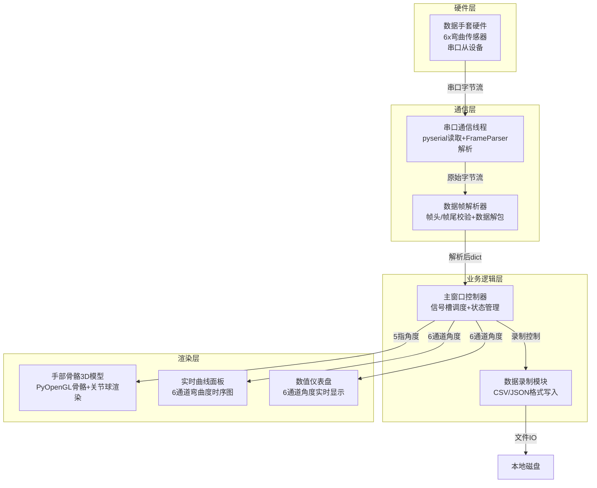
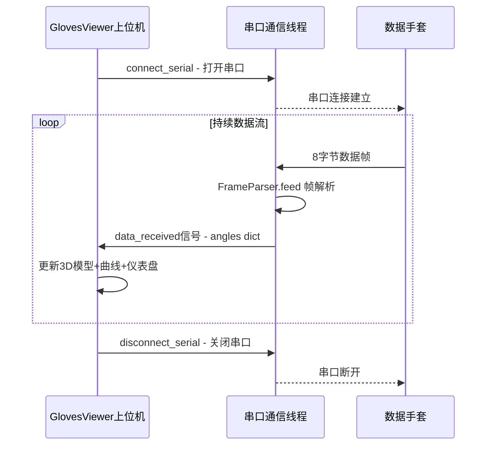
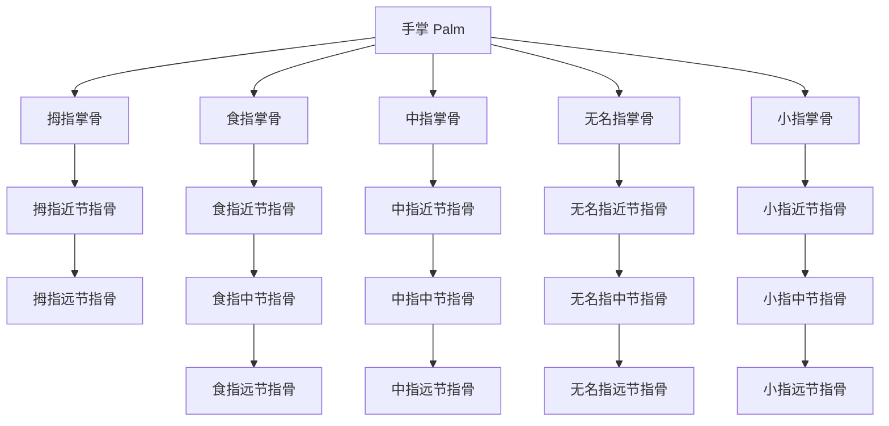

# GlovesViewer 数据手套上位机 — 架构设计文档

## 1. 项目概述

GlovesViewer 是一款单手数据手套上位机软件，通过串口与数据手套硬件通信，实时接收6通道弯曲度数据（拇指、食指、中指、无名指、小指、手背），并在三维场景中渲染手部骨骼模型，直观反映真实手部动作。

---

## 2. 技术栈

| 类别 | 选型 | 说明 |
|------|------|------|
| 语言 | Python 3.13 | 与现有项目保持一致 |
| GUI框架 | PyQt5 | 与现有项目保持一致 |
| 3D渲染 | PyOpenGL + pyqtgraph.opengl | 手部骨骼模型渲染 |
| 串口通信 | pyserial | 跨平台串口库，支持Windows/Linux/macOS |
| 数据可视化 | pyqtgraph | 实时曲线绘制 |
| 数据存储 | csv / json | 录制数据本地保存 |

---

## 3. 系统架构



---

## 4. 串口通信协议设计

### 4.1 串口参数

| 参数 | 值 | 说明 |
|------|------|------|
| 波特率 | 115200 | 默认，可选9600/921600 |
| 数据位 | 8 | |
| 校验位 | None | |
| 停止位 | 1 | |

### 4.2 数据帧格式

每帧 **8字节**：

```
+--------+--------+--------+--------+--------+--------+--------+--------+
| Byte0  | Byte1  | Byte2  | Byte3  | Byte4  | Byte5  | Byte6  | Byte7  |
+--------+--------+--------+--------+--------+--------+--------+--------+
| 0xFA   | Thumb  | Index  | Middle | Ring   | Pinky  | Palm   | 0xAA   |
| 帧头   | 拇指   | 食指   | 中指   | 无名指 | 小指   | 手背   | 帧尾   |
+--------+--------+--------+--------+--------+--------+--------+--------+
```

| 字段 | 偏移 | 长度 | 说明 |
|------|------|------|------|
| 帧头 | 0 | 1B | 固定 `0xFA` |
| 拇指 Thumb | 1 | 1B | 角度值，0~180，单位为度 |
| 食指 Index | 2 | 1B | 角度值，0~180，单位为度 |
| 中指 Middle | 3 | 1B | 角度值，0~180，单位为度 |
| 无名指 Ring | 4 | 1B | 角度值，0~180，单位为度 |
| 小指 Pinky | 5 | 1B | 角度值，0~180，单位为度 |
| 手背 Palm | 6 | 1B | 角度值，0~180，单位为度 |
| 帧尾 | 7 | 1B | 固定 `0xAA` |

**数据示例**：`FA 08 10 28 00 0C 00 AA`
- 拇指=8°, 食指=16°, 中指=40°, 无名指=0°, 小指=12°, 手背=0°

### 4.3 数据流时序



---

## 5. 手部骨骼3D模型设计

### 5.1 骨骼层级结构



> **注意**：手背(palm)通道数据仅用于仪表盘和曲线显示，不参与3D骨骼模型渲染。3D模型仅使用5指（thumb/index/middle/ring/pinky）角度数据。

### 5.2 骨骼尺寸参数（单位：相对长度）

| 手指 | 掌骨 | 近节 | 中节 | 远节 |
|------|------|------|------|------|
| 拇指 | 1.0 | 1.2 | 1.0 | — |
| 食指 | 1.6 | 1.6 | 1.2 | 0.9 |
| 中指 | 1.6 | 1.8 | 1.4 | 1.0 |
| 无名指 | 1.6 | 1.7 | 1.3 | 0.9 |
| 小指 | 1.4 | 1.3 | 1.0 | 0.8 |

### 5.3 弯曲度映射策略

每根手指只有1个弯曲度自由度（0°~180°），需要合理分配到各关节：

- **拇指**（2个关节）：弯曲度按 50%:50% 分配给掌指关节和指间关节
- **其余四指**（3个关节）：弯曲度按 40%:35%:25% 分配给掌指关节、近指间关节、远指间关节
- **最大弯曲限制**：掌指关节最大90°，指间关节最大100°
- **手掌展开**：所有角度为0°时，手指完全伸直

### 5.4 渲染方案

使用 `pyqtgraph.opengl` 的 `GLLinePlotItem` 绘制骨骼线段，`GLMeshItem`（球体）绘制关节球：

```
骨骼线段 ─── 手指对应颜色粗线段，宽度6px
关节球 ─── 手指对应颜色半透明球体，半径0.22
指尖球 ─── 亮色半透明球体，半径0.18
手掌面 ─── 暖灰色半透明平面网格
```

**更新机制**：每次收到新数据帧时，根据5个手指角度重新计算所有关节点的3D坐标，通过 `setData` 更新线段位置，通过 `resetTransform` + `translate` 更新关节球位置。

---

## 6. 软件模块设计

### 6.1 目录结构

```
libs/GlovesViewer/
├── main.py              # 程序入口，GlovesViewer主窗口类
├── requirements.txt     # 依赖清单
├── README.md            # 项目说明
├── .github/
│   └── workflows/
│       └── build.yml    # CI/CD打包配置
├── core/
│   ├── serial_thread.py # 串口通信线程（连接/读取/断开）
│   ├── frame_parser.py  # 数据帧解析器（帧头/帧尾检测+解包）
│   ├── hand_kinematics.py # 手部运动学模型（正运动学计算+关节坐标）
│   └── simulator.py     # 模拟数据生成器（正弦波/手动模式）
└── ui/
    ├── main_window.py   # UI静态布局类
    ├── hand_3d_widget.py # 手部3D骨骼渲染组件
    └── widgets.py       # 自定义小组件（角度仪表盘、手指滑条等）
```

### 6.2 模块职责

#### `core/serial_thread.py` — 串口通信线程

```python
class GloveSerialThread(QtCore.QThread):
    """基于pyserial的串口通信线程"""
    # 信号
    data_received = pyqtSignal(dict)  # {thumb, index, middle, ring, pinky, palm}
    log_received = pyqtSignal(str)    # 日志消息
    connection_changed = pyqtSignal(bool)  # 连接状态变化

    # 核心方法
    connect_serial(port, baudrate)  # 连接串口
    disconnect_serial()             # 断开串口
    list_available_ports()          # 列出可用串口（静态方法）
    run()                           # 线程主循环：读取串口+FrameParser解析
```

#### `core/frame_parser.py` — 数据帧解析器

```python
class FrameParser:
    """串口数据帧解析器，处理粘包/半包"""
    # 帧定义
    FRAME_HEADER = 0xFA
    FRAME_TAIL = 0xAA
    FRAME_LEN = 8  # 帧头(1) + 数据(6) + 帧尾(1)

    # 键名定义
    FINGER_KEYS = ['thumb', 'index', 'middle', 'ring', 'pinky']  # 5指，用于3D模型
    ALL_KEYS = ['thumb', 'index', 'middle', 'ring', 'pinky', 'palm']  # 6通道，用于UI展示

    def feed(self, raw_bytes: bytes) -> list[dict]:
        """输入原始字节，输出解析后的数据包列表"""
        # 1. 追加到缓冲区
        # 2. 搜索帧头 0xFA
        # 3. 提取8字节完整帧
        # 4. 验证帧尾 0xAA
        # 5. 解包6个角度值（每字节1个，0~180°）
        # 6. 返回 [{thumb: 8.0, index: 16.0, ..., palm: 0.0}]
```

#### `core/hand_kinematics.py` — 手部运动学模型

```python
class HandKinematics:
    """手部正运动学计算，根据5指弯曲度计算所有关节3D坐标"""
    FINGER_KEYS = ['thumb', 'index', 'middle', 'ring', 'pinky']

    def __init__(self):
        # 骨骼长度参数
        # 关节弯曲比例参数
        # 手掌基础坐标

    def compute(self, angles: dict) -> dict:
        """
        输入: {thumb: 45.0, index: 30.0, middle: 60.0, ring: 20.0, pinky: 10.0}
        输出: {
            joints: {thumb: [p0, p1, p2, p3], index: [...], ...},  # 关节坐标
            bones: {thumb: [(p0,p1),(p1,p2),(p2,p3)], ...}         # 骨骼线段端点
        }
        """
```

#### `core/simulator.py` — 模拟数据生成器

```python
class SimulatorThread(QtCore.QThread):
    """模拟数据线程，50Hz生成6通道模拟数据"""
    data_received = pyqtSignal(dict)  # {thumb, ..., palm}

    # 模式
    mode = 'sine'    # 'sine' 或 'manual'
    start_sim()      # 启动模拟
    stop_sim()       # 停止模拟
    set_manual_angle(finger, angle)  # 手动模式设置角度
```

#### `ui/hand_3d_widget.py` — 手部3D渲染组件

```python
class Hand3DWidget(gl.GLViewWidget):
    """继承GLViewWidget，封装手部骨骼3D渲染逻辑"""
    def __init__(self):
        # 创建手掌网格
        # 创建5组骨骼线段 GLLinePlotItem
        # 创建关节球 GLMeshItem（球体）
        # 创建坐标轴指示

    def update_hand(self, angles: dict):
        """根据5指弯曲度更新3D模型（palm字段自动忽略）"""
        # 更新骨骼线段位置
        # 更新关节球位置
```

#### `ui/widgets.py` — 自定义组件

```python
class AngleGaugeWidget(QtWidgets.QWidget):
    """单个通道角度仪表盘，显示名称+角度值+弧形进度条"""
    def __init__(self, finger_name: str):
        # 通道名称标签
        # 角度数值标签
        # 弧形进度条（0°~180°）

    def set_angle(self, angle: float):
        """更新角度显示"""

class FingerSliderGroup(QtWidgets.QGroupBox):
    """5指滑条控制器组，用于模拟手动模式"""
    angle_changed = pyqtSignal(str, float)  # finger_name, angle
```

---

## 7. UI界面布局

```
+========================================================================================+
| GlovesViewer v1.0 状态栏                                                               |
+==================+===================================+================================+
|                  |                                   |                                |
| [数据源选择]     |                                   | [实时曲线面板]                 |
| ○ 串口连接       |                                   | ┌──────────────────────┐       |
| ● 模拟-正弦波    |                                   | │ 拇指 ──────────── │       |
| ○ 模拟-手动控制  |                                   | │ 食指 ──────────── │       |
|                  |                                   | │ 中指 ──────────── │       |
| [串口连接]       |                                   | │ 无名指 ────────── │       |
| 端口: ▼          |    [3D手部骨骼模型]               | │ 小指 ──────────── │       |
| 波特率: 115200 ▼ |                                   | │ 手背 ──────────── │       |
| [刷新] [连接]    |    🖐️ 实时手部动作               | └──────────────────────┘       |
|                  |                                   |                                |
| [数据录制]       |                                   |                                |
| 格式: CSV ▼      |                                   |                                |
| [开始录制]       |                                   |                                |
| [停止录制]       |                                   |                                |
|                  |                                   |                                |
| [角度仪表盘]     |                                   |                                |
| 拇指 食指 中指   |                                   |                                |
| 无名 小指 手背   |                                   |                                |
|                  |                                   |                                |
| [原始数据流]     |                                   |                                |
| 拇指:8° 食指:16° |                                   |                                |
|                  |                                   |                                |
+==================+===================================+================================+
| 数据率: 50Hz     | 丢包率: 0.0%      | 数据源: 串口   | 连接状态: 已连接              |
+========================================================================================+
```

**三栏布局**（与IMUViewer风格一致）：
- **左栏**（270px）：数据源选择、串口连接控制、录制控制、6通道角度仪表盘、原始数据流
- **中栏**（弹性）：3D手部骨骼模型渲染区
- **右栏**（弹性）：6通道弯曲度实时时序曲线

---

## 8. 数据流架构


---

## 9. 关键技术要点

### 9.1 串口通信集成PyQt5

pyserial 是同步阻塞库，集成到 PyQt5 的方案：

- 使用 `QThread` 在独立线程中运行串口读取循环
- 串口设置短超时（`timeout=0.01`），保证线程响应性
- 无数据时 `time.sleep(0.001)` 避免CPU空转
- 通过 `pyqtSignal` 将数据从串口线程安全传递到主线程
- 连接/断开操作通过主线程调用线程方法

### 9.2 3D手部模型性能优化

- 50Hz更新频率下，避免每帧创建/销毁OpenGL对象
- 预创建所有 `GLLinePlotItem` 和 `GLMeshItem`，仅更新坐标数据
- 关节球使用 `GLMeshItem` 的 `resetTransform` + `translate` 实现位置更新
- 骨骼线段使用 `setData` 更新端点坐标

### 9.3 帧解析与粘包/半包处理

```python
class FrameParser:
    """处理串口数据流的粘包/半包问题"""
    def feed(self, raw_bytes: bytes) -> list[dict]:
        # 1. 追加到缓冲区
        # 2. 搜索帧头 0xFA
        # 3. 丢弃帧头前垃圾数据
        # 4. 检查是否有完整8字节帧
        # 5. 验证帧尾 0xAA
        # 6. 帧尾不匹配则丢弃1字节重新同步
        # 7. 解包6个角度值
```

---

## 10. 依赖清单

```
# requirements.txt
numpy
PyQt5
pyqtgraph
PyOpenGL
pyserial
```

---

## 11. 开发任务分解

1. 搭建项目骨架（目录结构 + requirements.txt + README.md）
2. 实现 `core/frame_parser.py` — 数据帧解析器（帧头0xFA/帧尾0xAA/8字节帧）
3. 实现 `core/hand_kinematics.py` — 手部运动学模型
4. 实现 `core/serial_thread.py` — 串口通信线程
5. 实现 `core/simulator.py` — 模拟数据生成器
6. 实现 `ui/widgets.py` — 角度仪表盘+手指滑条组件
7. 实现 `ui/hand_3d_widget.py` — 手部3D骨骼渲染组件
8. 实现 `ui/main_window.py` — 主窗口静态布局
9. 实现 `main.py` — 主窗口控制器与信号槽绑定
10. 集成测试与调试
11. 配置 CI/CD 打包流水线
